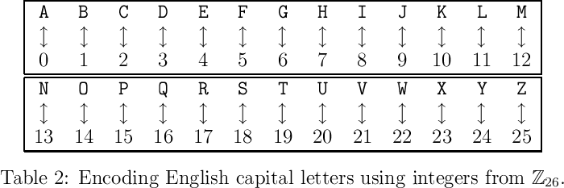

# Monoalphabetic Substitution Ciphers

Substitution ciphers are the most simple ciphers. Essentially, a substitution
cipher replaces a single letter with another. The mapping of cleartext letters
to ciphertext letters does not change over the course of the message. Hence,
substitution ciphers do not mask the letter frequency distribution, and this will
be our first technique in cracking them.   

## Atbash

## Pigpen

## Affine

## Mixed Alphabet

## Homophonic Substitution

## Morse Code

## Babbington Plot

## Adventure of Dancing Men

## Caesar Cipher

The Caesar cipher is a [mono-alphabetic](#def:mono-alphabetic) cipher. The Caesar cipher translates
all characters by a given offset. 

Given the cleartext:
```
DO NOT USE PC
```

To mask word boundaries we break the text into groups of 5.

```
DONOT USEPC
```
{#fig:1.1}


We can map each letter to a number using [Figure](#fig:1.1). 

```
[3][14][13][14][19] [20][18][4][15][2]
```

We then apply our key of {$$}n = 8{/$$}

{$$}
E(x) = (x + n) \mod{26}
{/$$}

{$$}
D(x) = (x - n) \mod{26}
{/$$}

```
11 22 21 22 1 \\ 2 0 12 23 10
```

Transforming back to text, we have our ciphertext

```
LWVWB CAMXK
```

[Excel](#ref:excel_ciphers) can be a simple tool to automate the arithmetic of this cipher.

| Convert to Number | Apply Transform            | Convert to Letter |
|-------------------|---------------------------|-------------------|
| =CODE(A1)-65	    | =MOD(A2 + CAESAR_KEY, 26)	| =CHAR(A3 + 65)	|

### Analyzing Caesar
The key technique for analyzing Caesar ciphers is frequency analysis. One counts
the occurrences of each given letter, and assumes the distribution matches the
English language. 

Let us cipher a paragraph and see how this works.

```
IN CRYPTANALYSIS, FREQUENCY ANALYSIS IS THE STUDY OF THE FREQUENCY OF LETTERS OR
GROUPS OF LETTERS IN A CIPHERTEXT. THE METHOD IS USED AS AN AID TO BREAKING
CLASSICAL CIPHERS.

FREQUENCY ANALYSIS IS BASED ON THE FACT THAT, IN ANY GIVEN STRETCH OF WRITTEN
LANGUAGE, CERTAIN LETTERS AND COMBINATIONS OF LETTERS OCCUR WITH VARYING
FREQUENCIES. MOREOVER, THERE IS A CHARACTERISTIC DISTRIBUTION OF LETTERS THAT IS
ROUGHLY THE SAME FOR ALMOST ALL SAMPLES OF THAT LANGUAGE. FOR INSTANCE, GIVEN
A SECTION OF ENGLISH LANGUAGE, E, T, A AND O ARE THE MOST COMMON, WHILE Z, Q AND
X ARE RARE. LIKEWISE, TH, ER, ON, AND AN ARE THE MOST COMMON PAIRS OF LETTERS
(TERMED BIGRAMS OR DIGRAPHS), AND SS, EE, TT, AND FF ARE THE MOST COMMON
REPEATS.[1] THE NONSENSE PHRASE "ETAOIN SHRDLU" REPRESENTS THE 12 MOST FREQUENT
LETTERS IN TYPICAL ENGLISH LANGUAGE TEXT.

IN SOME CIPHERS, SUCH PROPERTIES OF THE NATURAL LANGUAGE PLAINTEXT ARE PRESERVED
IN THE CIPHERTEXT, AND THESE PATTERNS HAVE THE POTENTIAL TO BE EXPLOITED IN
A CIPHERTEXT-ONLY ATTACK.
```

#### Python 

```
from collections import Counter
f = open("wikipedia_paragraph.txt", "r").read()
f2 = Counter(f)
f2.most_common()
```

Output:

```
[(' ', 156), ('E', 111), ('T', 88), ('A', 72), ('S', 63), ('N', 59), ('R', 59),
('I', 53), ('O', 47), ('H', 37), ('L', 33), ('C', 29), ('P', 21), (',', 20), ('G
', 20), ('F', 20), ('M', 19), ('U', 19), ('D', 18), ('\n', 17), ('Y', 13), ('.',
 8), ('X', 7), ('B', 6), ('Q', 6), ('V', 6), ('W', 4), ('K', 3), ('"', 2), ('1',
 2), (')', 1), ('(', 1), ('-', 1), ('2', 1), ('[', 1), ('Z', 1), (']', 1)]
```

#### C\#

```
string s = File.ReadAllText("wikipedia_paragraph.txt");
Dictionary<char, int> count = s
	.GroupBy( x => x )
	.ToDictionary(x => x.Key, x => x.Count());
```

Output:

```
Dictionary<char, int>(38) { { 'I', 53 }, { 'N', 59 }, { ' ', 156 }, { 'C', 29 },
 { 'R', 59 }, { 'Y', 13 }, { 'P', 21 }, { 'T', 88 }, { 'A', 72 }, { 'L', 33 }, {
 'S', 63 }, { ',', 20 }, { 'F', 20 }, { 'E', 111 }, { 'Q', 6 }, { 'U', 19 }, { '
H', 37 }, { 'D', 18 }, { 'O', 47 }, { '\r', 17 }, { '\n', 17 }, { 'G', 20 }, { '
X', 7 }, { '.', 8 }, { 'M', 19 }, { 'B', 6 }, { 'K', 3 }, { 'V', 6 }, { 'W', 4 }
, { 'Z', 1 }, { '(', 1 }, { ')', 1 }, { '[', 1 }, { '1', 2 }, { ']', 1 }, { '"',
 2 }, { '2', 1 }, { '-', 1 } }
```


